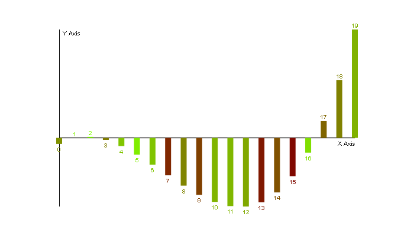

# Plotter.js
A JavaScript library to plot data.

## Getting started
Read the [Getting Started Guide](docs/getting-started.md) in the documentation.

## API reference
Read the [API reference](docs/reference-index) in the documentation.

## Method chaining
Read the article about [method chaining](docs/method-chaining.md) in the documentation.

## License
`Plotter.js` is licensed under the [MIT License](./LICENSE).
