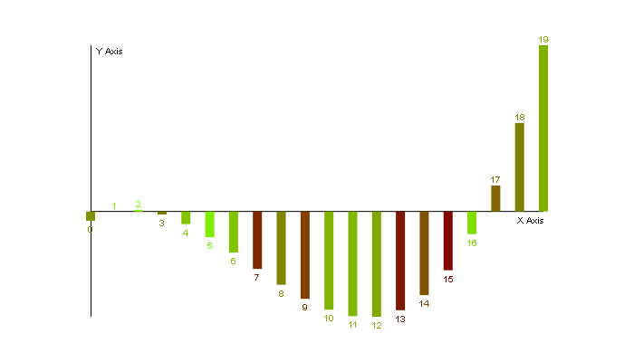
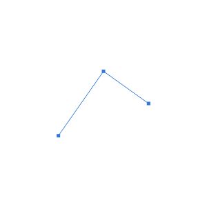

# Plotter.js
A JavaScript helper to plot data.


## API reference
* [`Plotter`](Plotter.md): description of the `Plotter` class.
* [`Point`](Point.md): description of the `Point` class.
* [`PointList`](PointList.md): description of the `PointList` class.
* [`types`](types.md): list of type definitions for this documentation.

## Getting started
Embed Plotter.js in your web page by including these three files:
* `Plotter.js`
* `Point.js`
* `PointList.js`
Example:
```HTML
<!DOCTYPE html>
<html>
  <head>
    <meta charset="utf-8">
    <title>Demo</title>

    <script src="js/lib/Plotter.js" charset="utf-8"></script>
    <script src="js/lib/Point.js" charset="utf-8"></script>
    <script src="js/lib/PointList.js" charset="utf-8"></script>

    <script type="text/javascript">
      document.addEventListener('DOMContentLoaded', () => {

        // JavaScript goes here

      })
    </script>
  </head>
  <body>
    <!-- HTML goes here, e.g. this canvas element -->
    <canvas id="canvas" width="300" height="300" style="background-color: lightgrey;"></canvas>
  </body>
</html>
```
Now create a new plotter and give it the canvas to operate on:
```JavaScript
const canvas = document.getElementById('canvas')
const plotter = new Plotter(canvas)
```
Now give it some data to draw:
```JavaScript
const list = plotter.getPointList()
const point1 = new Plotter.Point({ x: 80, y: 100 })
const point2 = new Plotter.Point({ x: 150, y: 200 })
const point3 = new Plotter.Point({ x: 220, y: 150 })
list.addPoints(point1, point2, point3)
```
Finally, draw the points to the canvas:
```JavaScript
plotter.setColor('#5599FF')
plotter.setPointSize(5)
plotter.drawLineChart()
```
Result:



[Demo page](demo.html)

## Method chaining
Every method in `Plotter.js` returns the object it operates on. This is not true if it would not make sense to do so (e.g. getter methods). This feature simplifies API calls on the same object. For example, instead of writing this:
```JavaScript
const canvas = plotter.getCanvas()
plotter.setColor('#5599FF') // call every method
plotter.setPointSize(5)     // in a separate
plotter.drawLineChart()     // statement
```
one could also write this:
```JavaScript
const canvas = plotter.getCanvas() // this cannot be part of the method chain
plotter.setColor('#5599FF').setPointSize(5).drawLineChart() // call the methods in a method chain
```
This works with the methods of the classes `Point` and `PointList`, as well:
```JavaScript
const maxY = pointList.addPoints(pointA, pointB).sort().getMaximumY()
```
Of course, you do not have to use this technique.
