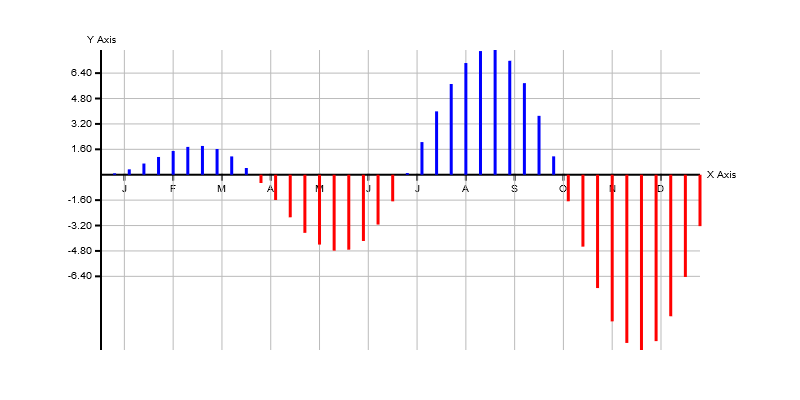
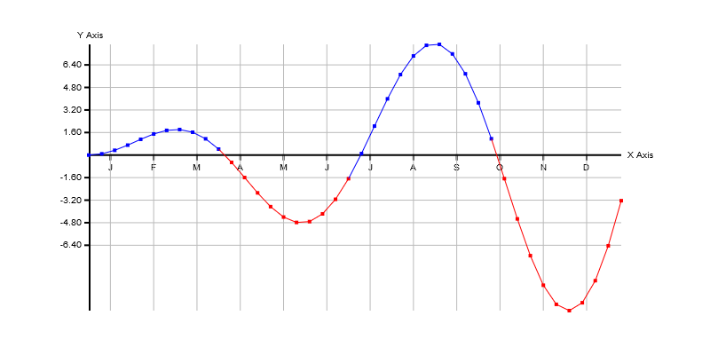

# Overview
[Home](./)

This article gives an overview over the `Plotter.js` library.

The goal of `Plotter.js` is to able to draw diagrams easily. Diagrams are always drawn to HTML `<canvas>`-elements. Every diagram is bound to one canvas.

## Diagrams

The data of diagrams is stored in points, which have a x and a y coordinate, and is grouped in point lists. Only whole point lists can be drawn on a diagram. There are currently two types of diagrams:

### Bar charts
The points are presented as bars.



### Line charts
The points are presented as single points and can be connected with a line.



## API structure
All of the API components live in the global `Plotter` namespace. For example, to create a new instance of the `Point` class, you have to use

```JavaScript
const point = new Plotter.Point()
```

### Object hierarchy
The following diagram shows how the classes in `Plotter.js` are related to each other.

```
Object
├── PointList
╰── ImageComponent
    ├── Point
    ╰── DataConsumer
        ├── Axis
        ╰── CanvasImage
            ╰── Diagram
```    
